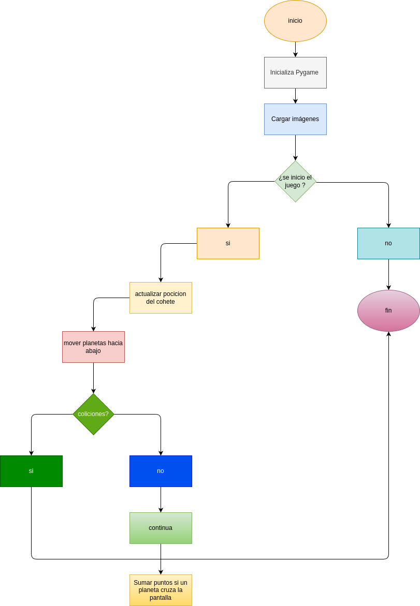

# Bimestral_1

## Descripción

Este es un juego sencillo en el que un cohete debe esquivar planetas que caen desde la parte superior de la pantalla. El jugador controla el cohete con las teclas izquierda y derecha. Si el cohete colisiona con un planeta, el juego termina.

---

## Explicación del Código

### Importación de módulos
```python
import pygame
from random import randint
```
Se importan las bibliotecas necesarias. `pygame` se usa para el desarrollo del juego y `randint` para generar posiciones aleatorias de los planetas.

### Inicialización de Pygame
```python
pygame.init()
```
Se inicializa Pygame para poder utilizar sus funciones.

### Configuración de la ventana
```python
ANCHURA_VENTANA = 600
ALTURA_VENTANA = 600
COLOR_FONDO = (255, 255, 250)
PANTALLA = pygame.display.set_mode((ANCHURA_VENTANA, ALTURA_VENTANA))
pygame.display.set_caption("PRIMER JUEGO")
```
Se definen las dimensiones de la ventana y su color de fondo. Luego, se crea la pantalla del juego y se establece el título de la ventana.

### Variables del cohete
```python
XX_COHETE = 250
YY_COHETE = 500
MOVIMIENTO_XX_COHETE = 0
VEL_COHETE = 4
ALTURA_COHETE = 88
ANCHURA_COHETE = 175
```
Se definen las coordenadas iniciales del cohete, su velocidad y sus dimensiones.

### Variables de los planetas
```python
ALTURA_PLANETA = 111
ANCHURA_PLANETA = 80
VELOCIDAD_PLANETAS = 2
```
Se establecen las dimensiones de los planetas y su velocidad de caída.

### Función para generar planetas en posiciones aleatorias
```python
def generar_planeta():
    return randint(30, 150), randint(-200, -50)
```
Esta función devuelve una posición aleatoria en el eje X y una posición negativa en Y para que los planetas aparezcan desde fuera de la pantalla.

### Posiciones iniciales de los planetas
```python
XX_PLANETA_IZQUIERDO, YY_PLANETA_IZQUIERDO = generar_planeta()
XX_PLANETA_DERECHO, YY_PLANETA_DERECHO = generar_planeta()
XX_ENTRE_PLANETAS = 350
```
Se generan dos planetas en posiciones aleatorias con una separación establecida.

### Puntos y marcador
```python
PUNTOS = 0
FUENTE = pygame.font.Font(None, 36)
MARCADOR = FUENTE.render("0 puntos", 1, (255, 0, 0))
```
Se inicializan los puntos del jugador y se define la fuente para mostrar la puntuación en pantalla.

### Cargar imágenes
```python
IMG_COHETE = pygame.image.load("img/COHETE.png")
IMG_PLANETA = pygame.image.load("img/PLANETA.png")
```
Se cargan las imágenes del cohete y del planeta.

### Bucle principal del juego
```python
PARAR_JUEGO = False
reloj = pygame.time.Clock()
```
Se inicia el bucle del juego y se crea un reloj para controlar los fotogramas por segundo.

### Captura de eventos del teclado
```python
for event in pygame.event.get():
    if event.type == pygame.QUIT:
        PARAR_JUEGO = True
    if event.type == pygame.KEYDOWN:
        if event.key == pygame.K_ESCAPE:
            PARAR_JUEGO = True
        if event.key == pygame.K_RIGHT:
            MOVIMIENTO_XX_COHETE = VEL_COHETE
        if event.key == pygame.K_LEFT:
            MOVIMIENTO_XX_COHETE = -VEL_COHETE
    if event.type == pygame.KEYUP:
        MOVIMIENTO_XX_COHETE = 0
```
Aquí se detectan los eventos del teclado. Si se presiona ESC, el juego termina. Con las teclas derecha e izquierda se mueve el cohete. Cuando se suelta la tecla, el cohete se detiene.

### Movimiento del cohete
```python
XX_COHETE += MOVIMIENTO_XX_COHETE
XX_COHETE = max(0, min(XX_COHETE, ANCHURA_VENTANA - ANCHURA_COHETE))
```
El cohete se mueve dentro de los límites de la pantalla.

### Movimiento y reinicio de los planetas
```python
YY_PLANETA_IZQUIERDO += VELOCIDAD_PLANETAS
YY_PLANETA_DERECHO += VELOCIDAD_PLANETAS

if YY_PLANETA_IZQUIERDO > ALTURA_VENTANA:
    XX_PLANETA_IZQUIERDO, YY_PLANETA_IZQUIERDO = generar_planeta()
    PUNTOS += 1
if YY_PLANETA_DERECHO > ALTURA_VENTANA:
    XX_PLANETA_DERECHO, YY_PLANETA_DERECHO = generar_planeta()
    PUNTOS += 1
```
Los planetas caen y si salen de la pantalla, se reinician en nuevas posiciones y se suman puntos al marcador.

### Detección de colisiones
```python
def colision(XX_PLANETA, YY_PLANETA):
    return (XX_COHETE < XX_PLANETA + ANCHURA_PLANETA and
            XX_COHETE + ANCHURA_COHETE > XX_PLANETA and
            YY_COHETE < YY_PLANETA + ALTURA_PLANETA and
            YY_COHETE + ALTURA_COHETE > YY_PLANETA)

if colision(XX_PLANETA_IZQUIERDO, YY_PLANETA_IZQUIERDO) or colision(XX_PLANETA_DERECHO + XX_ENTRE_PLANETAS, YY_PLANETA_DERECHO):
    PARAR_JUEGO = True
```
Si el cohete choca con algún planeta, el juego se detiene.

### Dibujar elementos en pantalla
```python
PANTALLA.fill(COLOR_FONDO)
PANTALLA.blit(IMG_PLANETA, (XX_PLANETA_IZQUIERDO, YY_PLANETA_IZQUIERDO))
PANTALLA.blit(IMG_PLANETA, (XX_PLANETA_DERECHO + XX_ENTRE_PLANETAS, YY_PLANETA_DERECHO))
PANTALLA.blit(IMG_COHETE, (XX_COHETE, YY_COHETE))

MARCADOR = FUENTE.render(f"{PUNTOS} puntos", 1, (255, 0, 0))
PANTALLA.blit(MARCADOR, (20, 20))
```
Se actualiza la pantalla con los elementos del juego: el fondo, los planetas, el cohete y el marcador de puntos.

### Actualización de la pantalla y control de FPS
```python
pygame.display.update()
reloj.tick(60)
```
Se actualiza la pantalla y se mantiene el juego a 60 FPS.

### Cierre de Pygame
```python
pygame.quit()
```
Cuando el juego termina, se cierra Pygame.

---

## Controles del Juego
- **Flecha izquierda (←)**: Mueve el cohete a la izquierda.
- **Flecha derecha (→)**: Mueve el cohete a la derecha.
- **ESC**: Sale del juego.

## Objetivo del Juego
El objetivo es esquivar los planetas y sobrevivir el mayor tiempo posible, acumulando puntos cada vez que un planeta desaparece y reaparece en la pantalla.

# Diagrama de flujo



